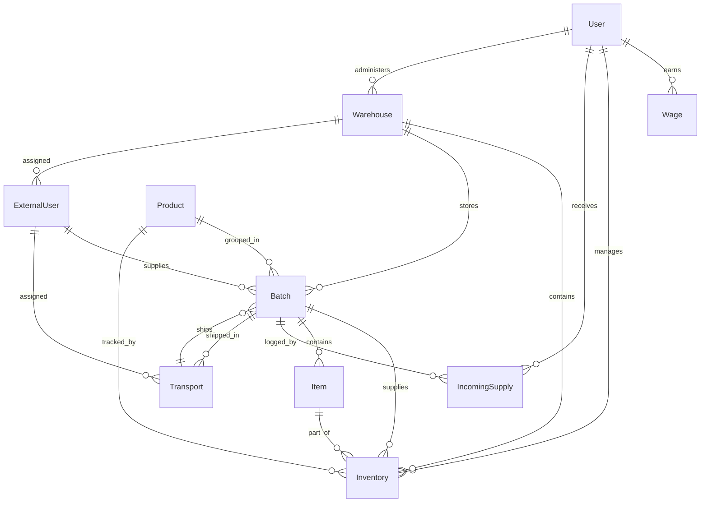
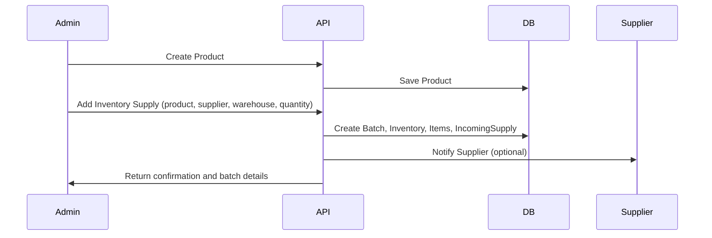

# SmartStock API & Models Documentation

## Overview

SmartStock is an inventory and supply chain management system. This documentation provides a comprehensive reference for all API endpoints and data models, including request/response payloads, validation rules, and relationships. Use this as a single source of truth for backend integration and development.

---

## Table of Contents

1. [User](#user)
2. [Product](#product)
3. [Inventory](#inventory)
4. [Item](#item)
5. [Batch](#batch)
6. [Transport](#transport)
7. [Warehouse](#warehouse)
8. [Wage](#wage)
9. [External User](#external-user)
10. [Incoming Supply](#incoming-supply)
11. [Authentication](#authentication)
12. [Health](#health)

---

# 1. User

## Model: User

The User model represents a system user (admin, staff, or viewer).

| Field                     | Type     | Required | Default    | Description                                 |
| ------------------------- | -------- | -------- | ---------- | ------------------------------------------- |
| fullName                  | String   | Yes      |            | Full name of the user                       |
| email                     | String   | Yes      |            | Unique email address (lowercase, trimmed)   |
| password                  | String   | Yes      |            | Hashed password                             |
| phone                     | String   | Yes      |            | Mobile phone number                         |
| avatar                    | String   | No       | URL        | Profile image URL                           |
| role                      | String   | No       | 'viewer'   | User role: 'admin', 'staff', 'viewer'       |
| shift                     | String   | No       |            | Work shift: 'morning', 'afternoon', 'night' |
| wagePerHour               | Number   | Yes      | 0          | Hourly wage                                 |
| hoursThisMonth            | Number   | No       | 0          | Hours worked this month                     |
| status                    | String   | No       | 'inactive' | 'active', 'inactive', 'suspended'           |
| assignedWarehouseId       | ObjectId | No       |            | Reference to Warehouse                      |
| isVerified                | Boolean  | No       | false      | Email verified status                       |
| verificationToken         | String   | No       | null       | Email verification token                    |
| resetPasswordToken        | String   | No       | null       | Password reset token                        |
| resetPasswordTokenExpires | Date     | No       | null       | Password reset token expiry                 |
| lastLogin                 | Date     | No       |            | Last login timestamp                        |
| createdAt                 | Date     | Auto     |            | Creation timestamp (auto-managed)           |
| updatedAt                 | Date     | Auto     |            | Update timestamp (auto-managed)             |

### Relationships

- `assignedWarehouseId` references the Warehouse model.

---

## API Endpoints

### 1. Get My Details

- **GET** `/api/user/me`
- **Auth:** Required (any user)
- **Description:** Get details of the currently authenticated user.
- **Response Example:**

```json
{
  "message": "User details fetched successfully.",
  "user": {
    "id": "<userId>",
    "fullName": "John Doe",
    "email": "john@example.com",
    "role": "staff",
    "status": "active",
    "assignedWarehouseId": {
      "_id": "<warehouseId>",
      "warehouseName": "Main Warehouse",
      "address": "123 St"
    },
    "avatar": "<url>",
    "isVerified": true,
    "createdAt": "2025-07-01T12:00:00.000Z",
    "updatedAt": "2025-07-01T12:00:00.000Z",
    "lastLogin": "2025-07-01T12:00:00.000Z"
  }
}
```

### 2. Create User

- **POST** `/api/user/create`
- **Auth:** Required (admin only)
- **Description:** Create a new staff or viewer user.
- **Request Payload Example:**

```json
{
  "fullName": "Jane Smith",
  "email": "jane@example.com",
  "password": "password123",
  "phone": "+1234567890",
  "role": "staff",
  "wagePerHour": 20
}
```

- **Validation:**
  - `fullName`, `email`, `password`, `phone`, `role`, `wagePerHour` are required
  - `role` must be 'staff' or 'viewer'
  - `email` must be unique and valid
  - `password` min 6 chars
  - `phone` must be a valid mobile number
- **Response Example:**

```json
{
  "message": "User created successfully.",
  "user": {
    "id": "<userId>",
    "fullName": "Jane Smith",
    "email": "jane@example.com",
    "phone": "+1234567890",
    "wagePerHour": 20,
    "role": "staff",
    "status": "inactive",
    "isVerified": false,
    "assignedWarehouseId": "<warehouseId>"
  }
}
```

- **Error Responses:**
  - 400: User with this email already exists
  - 403: Admins cannot create admins

### 3. Get All Users

- **GET** `/api/user/all`
- **Auth:** Required (admin only)
- **Description:** Get all users in the admin's assigned warehouse.
- **Response Example:**

```json
{
  "message": "All users fetched successfully.",
  "totalUsers": 2,
  "users": [
    {
      "_id": "<userId>",
      "fullName": "Jane Smith",
      "role": "staff",
      "status": "active",
      "assignedWarehouseId": {
        "_id": "<warehouseId>",
        "warehouseName": "Main Warehouse",
        "address": "123 St"
      }
    }
  ]
}
```

### 4. Get User Details

- **GET** `/api/user/:id`
- **Auth:** Required (admin or canViewUserDetails)
- **Description:** Get details of a specific user by ID.
- **Response Example:**

```json
{
  "message": "User details fetched successfully.",
  "user": {
    "id": "<userId>",
    "fullName": "Jane Smith",
    "email": "jane@example.com",
    "role": "staff",
    "status": "active",
    "assignedLocation": {
      "_id": "<warehouseId>",
      "name": "Main Warehouse",
      "code": "WH001"
    },
    "avatar": "<url>",
    "isVerified": true,
    "createdAt": "2025-07-01T12:00:00.000Z",
    "updatedAt": "2025-07-01T12:00:00.000Z",
    "lastLogin": "2025-07-01T12:00:00.000Z"
  }
}
```

- **Error Responses:**
  - 404: User not found

### 5. Update User

- **PUT** `/api/user/update/:id`
- **Auth:** Required (admin only)
- **Description:** Update user details. Only provided fields are updated.
- **Request Payload Example:**

```json
{
  "fullName": "Jane Smith",
  "email": "jane.smith@example.com",
  "role": "viewer",
  "status": "active",
  "phone": "+1234567890",
  "avatar": "<url>",
  "shift": "morning",
  "wagePerHour": 22,
  "hoursThisMonth": 160
}
```

- **Response Example:**

```json
{
  "message": "User updated successfully.",
  "user": {
    "id": "<userId>",
    "fullName": "Jane Smith",
    "email": "jane.smith@example.com",
    "phone": "+1234567890",
    "avatar": "<url>",
    "role": "viewer",
    "status": "active",
    "shift": "morning",
    "wagePerHour": 22,
    "hoursThisMonth": 160,
    "assignedWarehouseId": "<warehouseId>",
    "isVerified": true,
    "createdAt": "2025-07-01T12:00:00.000Z",
    "updatedAt": "2025-07-01T12:00:00.000Z",
    "lastLogin": "2025-07-01T12:00:00.000Z"
  }
}
```

- **Error Responses:**
  - 400: Invalid email, role, status, shift, wagePerHour, or hoursThisMonth
  - 404: User not found

### 6. Delete User

- **DELETE** `/api/user/delete/:id`
- **Auth:** Required (admin only)
- **Description:** Delete a user by ID.
- **Response Example:**

```json
{
  "message": "User deleted successfully."
}
```

- **Error Responses:**
  - 404: User not found
  - 400: Cannot delete your own account

---

# 2. Product

## Model: Product

The Product model represents an item that can be managed in inventory.

| Field              | Type       | Required | Default | Description                                              |
| ------------------ | ---------- | -------- | ------- | -------------------------------------------------------- |
| productName        | String     | Yes      |         | Name of the product                                      |
| productImage       | String     | Yes      |         | URL to product image                                     |
| unit               | String     | Yes      |         | Unit of measurement (e.g., kg, pcs)                      |
| manufacturer       | String     | No       |         | Manufacturer name                                        |
| productCategory    | String     | No       |         | Category: 'electronics', 'apparel', 'decor', 'furniture' |
| sku                | String     | Yes      |         | Unique SKU (uppercase)                                   |
| price              | Number     | Yes      |         | Price per unit                                           |
| quantity           | Number     | Yes      | 0       | Current stock quantity                                   |
| weight             | Number     | No       | 0       | Weight per unit                                          |
| dimension          | Object     | Yes      |         | { length, breadth, height } (all required)               |
| volume             | Number     | No       | calc    | Auto-calculated: length × breadth × height               |
| thresholdLimit     | Number     | No       | 10      | Minimum stock before restock is recommended              |
| restockRecommended | Boolean    | No       | calc    | True if quantity ≤ thresholdLimit                        |
| shelfLifeDays      | Number     | Yes      |         | Shelf life in days                                       |
| batchNumber        | Number     | No       |         | Batch number                                             |
| mfgDate            | Date       | No       |         | Manufacturing date                                       |
| expDate            | Date       | No       |         | Expiry date                                              |
| isActive           | Boolean    | No       | false   | Whether product is active                                |
| supplierIds        | [ObjectId] | No       |         | References to ExternalUser (suppliers)                   |
| createdAt          | Date       | Auto     |         | Creation timestamp                                       |
| updatedAt          | Date       | Auto     |         | Update timestamp                                         |

### Relationships

- `supplierIds` references ExternalUser (suppliers)

---

## API Endpoints

### 1. Create Product

- **POST** `/api/product/add`
- **Auth:** Required (admin only)
- **Description:** Create a new product.
- **Request Payload Example:**

```json
{
  "productName": "LED TV",
  "productImage": "https://example.com/tv.jpg",
  "unit": "pcs",
  "manufacturer": "Sony",
  "productCategory": "electronics",
  "sku": "TV123",
  "price": 499.99,
  "weight": 10,
  "dimension": { "length": 100, "breadth": 20, "height": 60 },
  "thresholdLimit": 5,
  "shelfLifeDays": 730
}
```

- **Validation:**
  - All fields except manufacturer, productCategory, weight, thresholdLimit are required
  - `productImage` must be a valid URL
  - `sku` must be unique
  - `dimension` must include length, breadth, height
- **Response Example:**

```json
{
  "message": "Product created successfully.",
  "product": {
    "_id": "<productId>",
    "productName": "LED TV",
    "sku": "TV123",
    ...
  }
}
```

- **Error Responses:**
  - 400: Product with this sku already exists

### 2. Get All Products

- **GET** `/api/product/all`
- **Auth:** Required (admin, staff)
- **Description:** Get all products.
- **Response Example:**

```json
{
  "numberOfProducts": 2,
  "message": "Products fetched successfully.",
  "products": [
    {
      "_id": "<productId>",
      "productName": "LED TV",
      "sku": "TV123",
      "productImage": "https://example.com/tv.jpg",
      "unit": "pcs",
      "manufacturer": "Sony",
      "productCategory": "electronics",
      "price": 499.99,
      "quantity": 20,
      "weight": 10,
      "dimension": { "length": 100, "breadth": 20, "height": 60 },
      "volume": 120000,
      "thresholdLimit": 5,
      "shelfLifeDays": 730,
      "isActive": true,
      "createdAt": "2025-07-01T12:00:00.000Z",
      "updatedAt": "2025-07-01T12:00:00.000Z"
    }
  ]
}
```

- **Error Responses:**
  - 404: No products found

### 3. Get Product By ID

- **GET** `/api/product/:id`
- **Auth:** Required (admin, staff)
- **Description:** Get details of a product by ID.
- **Response Example:**

```json
{
  "product": {
    "_id": "<productId>",
    "productName": "LED TV",
    "sku": "TV123",
    "productImage": "https://example.com/tv.jpg",
    "unit": "pcs",
    "manufacturer": "Sony",
    "productCategory": "electronics",
    "price": 499.99,
    "quantity": 20,
    "weight": 10,
    "dimension": { "length": 100, "breadth": 20, "height": 60 },
    "volume": 120000,
    "thresholdLimit": 5,
    "shelfLifeDays": 730,
    "isActive": true,
    "createdAt": "2025-07-01T12:00:00.000Z",
    "updatedAt": "2025-07-01T12:00:00.000Z"
  }
}
```

- **Error Responses:**
  - 404: Product not found

### 4. Update Product

- **PUT** `/api/product/update/:id`
- **Auth:** Required (admin only)
- **Description:** Update product details. Only provided fields are updated.
- **Request Payload Example:**

```json
{
  "productName": "LED TV 4K",
  "price": 599.99,
  "quantity": 25,
  "isActive": true
}
```

- **Response Example:**

```json
{
  "message": "Product updated successfully.",
  "product": {
    "_id": "<productId>",
    "productName": "LED TV 4K",
    ...
  }
}
```

- **Error Responses:**
  - 404: Product not found

### 5. Delete Product

- **DELETE** `/api/product/delete/:id`
- **Auth:** Required (admin only)
- **Description:** Delete a product by ID.
- **Response Example:**

```json
{
  "message": "Product deleted successfully.",
  "product": { "_id": "<productId>", ... }
}
```

- **Error Responses:**
  - 404: Product not found

---

# 3. Inventory

## Model: Inventory

The Inventory model represents the stock of a specific batch of a product in a warehouse.

| Field       | Type     | Required | Description                              |
| ----------- | -------- | -------- | ---------------------------------------- |
| batchId     | ObjectId | Yes      | Reference to Batch                       |
| quantity    | Number   | Yes      | Quantity of items in this batch in stock |
| warehouseId | ObjectId | Yes      | Reference to Warehouse                   |
| createdAt   | Date     | Auto     | Creation timestamp                       |
| updatedAt   | Date     | Auto     | Update timestamp                         |

### Relationships

- `batchId` references the Batch model
- `warehouseId` references the Warehouse model

---

## API Endpoints

### 1. Add Inventory Supply

- **POST** `/api/inventory/add-supply`
- **Auth:** Required (any authenticated user)
- **Description:** Add a new supply batch to inventory. This creates a batch, logs incoming supply, updates inventory, and creates item records.
- **Request Payload Example:**

```json
{
  "productId": "<productId>",
  "supplierId": "<supplierId>",
  "warehouseId": "<warehouseId>",
  "quantity": 100,
  "mfgDate": "2025-06-01",
  "expDate": "2026-06-01",
  "notes": "First supply batch"
}
```

- **Validation:**
  - All fields except `notes` are required
  - All IDs must be valid Mongo IDs
  - `quantity` must be a positive integer
  - `mfgDate` and `expDate` must be valid dates (YYYY-MM-DD)
- **Response Example:**

```json
{
  "message": "Supply added to inventory successfully.",
  "batchId": "<batchId>",
  "itemsCreated": 100
}
```

- **Error Responses:**
  - 400: All required fields must be provided
  - 404: Product not found

### 2. View All Inventory

- **GET** `/api/inventory/all`
- **Auth:** Required (admin, staff)
- **Description:** Get all inventory batches with product, supplier, and warehouse details.
- **Response Example:**

```json
{
  "message": "Inventory fetched successfully.",
  "totalBatches": 2,
  "inventory": [
    {
      "_id": "<inventoryId>",
      "batchId": {
        "_id": "<batchId>",
        "productId": { "_id": "<productId>", "productName": "LED TV", "sku": "TV123", ... },
        "supplierId": { "_id": "<supplierId>", "fullName": "Supplier A", ... },
        ...
      },
      "quantity": 100,
      "warehouseId": { "_id": "<warehouseId>", "warehouseName": "Main Warehouse", ... },
      "createdAt": "2025-07-01T12:00:00.000Z",
      "updatedAt": "2025-07-01T12:00:00.000Z"
    }
  ]
}
```

### 3. Get Inventory By Product

- **GET** `/api/inventory/product/:productId`
- **Auth:** Required (admin, staff)
- **Description:** Get all inventory entries for a specific product.
- **Response Example:**

```json
{
  "success": true,
  "message": "Inventory for product ID <productId>",
  "data": [
    {
      "_id": "<inventoryId>",
      "batchId": { ... },
      "quantity": 50,
      "warehouseId": { ... },
      ...
    }
  ]
}
```

- **Error Responses:**
  - 404: Product not found (if productId is invalid)

### 4. Mark Damaged Inventory

- **POST** `/api/inventory/mark-damaged`
- **Auth:** Required (admin, staff)
- **Description:** Mark a quantity of items in a batch as damaged, reducing inventory and updating item status/history.
- **Request Payload Example:**

```json
{
  "batchId": "<batchId>",
  "quantity": 5,
  "reason": "Damaged during transport"
}
```

- **Response Example:**

```json
{
  "message": "5 item(s) marked as damaged and inventory adjusted."
}
```

- **Error Responses:**
  - 400: Insufficient inventory to mark damaged / Not enough in-stock items

---

# 4. Item

## Model: Item

The Item model represents an individual, trackable unit of a product, typically belonging to a batch.

| Field              | Type     | Required | Default    | Description                                           |
| ------------------ | -------- | -------- | ---------- | ----------------------------------------------------- |
| batchId            | ObjectId | Yes      |            | Reference to Batch                                    |
| productId          | ObjectId | Yes      |            | Reference to Product                                  |
| serialNumber       | String   | Yes      |            | Unique serial number for the item                     |
| currentWarehouseId | ObjectId | No       |            | Reference to Warehouse where item is currently stored |
| status             | String   | No       | 'in_stock' | 'in_stock', 'dispatched', 'returned', 'damaged'       |
| history            | Array    | No       |            | List of status/action changes (see below)             |
| createdAt          | Date     | Auto     |            | Creation timestamp                                    |
| updatedAt          | Date     | Auto     |            | Update timestamp                                      |

#### History Subdocument

- `action`: 'added', 'dispatched', 'returned', 'transferred', 'damaged'
- `date`: Date of action
- `location`: String (location/warehouse info)
- `notes`: String (optional notes)

### Relationships

- `batchId` references the Batch model
- `productId` references the Product model
- `currentWarehouseId` references the Warehouse model

---

## API Endpoints

### 1. Get All Items

- **GET** `/api/item/all`
- **Auth:** Required (admin, staff)
- **Description:** Get all items with product, batch, and warehouse details.
- **Response Example:**

```json
[
  {
    "_id": "<itemId>",
    "batchId": { ... },
    "productId": { ... },
    "serialNumber": "TV123-uuid",
    "currentWarehouseId": { ... },
    "status": "in_stock",
    "history": [ ... ],
    "createdAt": "2025-07-01T12:00:00.000Z",
    "updatedAt": "2025-07-01T12:00:00.000Z"
  }
]
```

### 2. Get Item By ID

- **GET** `/api/item/:id`
- **Auth:** Required (admin, staff)
- **Description:** Get details of a specific item by ID.
- **Response Example:**

```json
{
  "_id": "<itemId>",
  "batchId": { ... },
  "productId": { ... },
  "serialNumber": "TV123-uuid",
  "currentWarehouseId": { ... },
  "status": "in_stock",
  "history": [ ... ],
  "createdAt": "2025-07-01T12:00:00.000Z",
  "updatedAt": "2025-07-01T12:00:00.000Z"
}
```

- **Error Responses:**
  - 404: Item not found

### 3. Get Items By Batch

- **GET** `/api/item/batch/:batchId`
- **Auth:** Required (admin, staff)
- **Description:** Get all items belonging to a specific batch.
- **Response Example:**

```json
[
  {
    "_id": "<itemId>",
    "batchId": "<batchId>",
    "productId": "<productId>",
    "serialNumber": "TV123-uuid",
    "status": "in_stock",
    ...
  }
]
```

### 4. Update Item Status

- **PUT** `/api/item/update-status/:id`
- **Auth:** Required (admin, staff)
- **Description:** Update the status of an item and append to its history.
- **Request Payload Example:**

```json
{
  "status": "damaged",
  "notes": {
    "location": "Warehouse A",
    "message": "Damaged during handling"
  }
}
```

- **Response Example:**

```json
{
  "message": "Item status updated",
  "item": { ... }
}
```

- **Error Responses:**
  - 404: Item not found

---

# 5. Batch

## Model: Batch

The Batch model represents a batch of products supplied to a warehouse, typically from a supplier.

| Field       | Type     | Required | Default  | Description                                         |
| ----------- | -------- | -------- | -------- | --------------------------------------------------- |
| batchNumber | String   | Yes      |          | Unique batch identifier (e.g., 'BATCH-<timestamp>') |
| productId   | ObjectId | Yes      |          | Reference to Product                                |
| warehouseId | ObjectId | Yes      |          | Reference to Warehouse                              |
| supplierId  | ObjectId | Yes      |          | Reference to ExternalUser (supplier)                |
| quantity    | Number   | Yes      |          | Quantity of items in this batch                     |
| mfgDate     | Date     | Yes      |          | Manufacturing date                                  |
| expDate     | Date     | Yes      |          | Expiry date                                         |
| receivedAt  | Date     | No       | Date.now | When the batch was received                         |
| condition   | String   | No       | 'new'    | 'new', 'damaged', 'expired'                         |
| status      | String   | No       | 'active' | 'active', 'used', 'expired'                         |
| createdAt   | Date     | Auto     |          | Creation timestamp                                  |
| updatedAt   | Date     | Auto     |          | Update timestamp                                    |

### Relationships

- `productId` references the Product model
- `warehouseId` references the Warehouse model
- `supplierId` references the ExternalUser (supplier) model

---

## API Endpoints

Batch creation and management are handled via the Inventory endpoints (see Inventory section). There are no direct batch-specific API endpoints.

---

# 6. Transport

## Model: Transport

The Transport model represents a shipment or transfer of product batches between locations.

| Field          | Type     | Required | Default  | Description                                                   |
| -------------- | -------- | -------- | -------- | ------------------------------------------------------------- |
| packageId      | String   | Yes      |          | Unique package identifier (e.g., 'PKG-XXXX')                  |
| trackingNumber | String   | Yes      |          | Unique tracking number (e.g., 'TRK-XXXX')                     |
| transportCost  | Number   | Yes      |          | Cost of transport                                             |
| totalWeight    | Number   | Yes      |          | Total weight of all products in the shipment                  |
| totalVolume    | Number   | Yes      |          | Total volume of all products in the shipment                  |
| totalValue     | Number   | Yes      |          | Total value of all products in the shipment                   |
| status         | String   | Yes      |          | 'pending', 'dispatched', 'intransit', 'delivered', 'returned' |
| products       | Array    | Yes      |          | List of { batchId, quantity } objects                         |
| location       | Object   | Yes      |          | { from: String, to: String }                                  |
| assignedTo     | ObjectId | Yes      |          | Reference to ExternalUser (transporter)                       |
| transportMode  | String   | Yes      |          | 'land', 'air', 'ship'                                         |
| createdAt      | Date     | Auto     | Date.now | Creation timestamp                                            |
| dispatchedAt   | Date     | No       |          | When the shipment was dispatched                              |
| updatedAt      | Date     | Auto     | Date.now | Last update timestamp                                         |

### Relationships

- `products.batchId` references the Batch model
- `assignedTo` references the ExternalUser (transporter) model

---

## API Endpoints

### 1. Create Transport

- **POST** `/api/transport/create`
- **Auth:** Required (admin, staff)
- **Description:** Create a new transport/shipment for one or more product batches.
- **Request Payload Example:**

```json
{
  "transportCost": 500,
  "products": [
    { "batchId": "<batchId1>", "quantity": 10 },
    { "batchId": "<batchId2>", "quantity": 5 }
  ],
  "location": { "from": "Warehouse A", "to": "Warehouse B" },
  "assignedTo": "<transporterId>",
  "transportMode": "land"
}
```

- **Validation:**
  - All fields are required
  - Each product must have a valid batchId and quantity
  - `assignedTo` must be a valid transporter
- **Response Example:**

```json
{
  "message": "Transport created successfully",
  "transport": {
    "_id": "<transportId>",
    "packageId": "PKG-XXXX",
    "trackingNumber": "TRK-XXXX",
    ...
  }
}
```

- **Error Responses:**
  - 400: Insufficient inventory for batch

### 2. Get All Transports

- **GET** `/api/transport/all`
- **Auth:** Required (admin, staff, transporter)
- **Description:** Get all transports. Transporters only see their assigned transports.
- **Response Example:**

```json
[
  {
    "_id": "<transportId>",
    "packageId": "PKG-XXXX",
    "trackingNumber": "TRK-XXXX",
    "status": "dispatched",
    "products": [ ... ],
    "location": { "from": "Warehouse A", "to": "Warehouse B" },
    "assignedTo": { "_id": "<transporterId>", "fullName": "John Doe" },
    ...
  }
]
```

### 3. Update Transport Status

- **PATCH** `/api/transport/update/:id`
- **Auth:** Required (transporter)
- **Description:** Update the status of a transport (e.g., to 'intransit', 'delivered', 'returned').
- **Request Payload Example:**

```json
{
  "status": "delivered"
}
```

- **Response Example:**

```json
{
  "message": "Transport status updated",
  "transport": { ... }
}
```

- **Error Responses:**
  - 400: Invalid status
  - 404: Transport not found
  - 403: Not authorized to update this transport

---

# 7. Warehouse

## Model: Warehouse

The Warehouse model represents a physical storage location for products and inventory.

| Field         | Type     | Required | Default  | Description                                              |
| ------------- | -------- | -------- | -------- | -------------------------------------------------------- |
| warehouseName | String   | No       |          | Name of the warehouse                                    |
| capacity      | Number   | Yes      |          | Maximum storage capacity                                 |
| unit          | String   | Yes      |          | Unit of measurement for capacity (e.g., kg, liters, pcs) |
| adminId       | ObjectId | Yes      |          | Reference to User (admin of the warehouse)               |
| address       | Object   | Yes      |          | Address object (see below)                               |
| status        | String   | No       | 'active' | 'active', 'inactive', 'maintenance'                      |
| createdAt     | Date     | Auto     | Date.now | Creation timestamp                                       |
| updatedAt     | Date     | Auto     | Date.now | Last update timestamp                                    |

#### Address Subdocument

- `street`: String (required)
- `city`: String (required)
- `state`: String (required)
- `zipcode`: String (required)
- `country`: String (required)

### Relationships

- `adminId` references the User model
- Referenced by Inventory, Batch, Item, and User models

---

## API Endpoints

There are no direct warehouse-specific API endpoints. Warehouse management is handled internally or via admin scripts.

---

# 8. Wage

## Model: Wage

The Wage model represents the monthly wage calculation and payment status for a user.

| Field        | Type     | Required | Default   | Description                        |
| ------------ | -------- | -------- | --------- | ---------------------------------- |
| userId       | ObjectId | Yes      |           | Reference to User                  |
| month        | String   | Yes      |           | Month in format 'YYYY-MM'          |
| generatedAt  | Date     | No       | Date.now  | When the wage record was generated |
| wageForMonth | Number   | Yes      |           | Calculated wage for the month      |
| hoursWorked  | Number   | Yes      |           | Total hours worked in the month    |
| overTime     | Number   | No       | 0         | Overtime hours                     |
| wagePerHour  | Number   | Yes      |           | Hourly wage rate                   |
| totalPay     | Number   | Yes      |           | Total pay (including overtime)     |
| paidStatus   | String   | No       | 'pending' | 'pending', 'paid'                  |
| paidAt       | Date     | No       |           | When the wage was paid             |
| createdAt    | Date     | Auto     |           | Creation timestamp                 |
| updatedAt    | Date     | Auto     |           | Update timestamp                   |

### Relationships

- `userId` references the User model

---

## API Endpoints

There are no direct wage-specific API endpoints. Wage records are managed internally or via admin scripts.

---

# 9. External User (Supplier & Transporter)

## Model: ExternalUser

The ExternalUser model represents users who are either suppliers or transporters for the system.

| Field       | Type     | Required | Default    | Description                       |
| ----------- | -------- | -------- | ---------- | --------------------------------- |
| fullName    | String   | Yes      |            | Full name of the external user    |
| companyName | String   | Yes      |            | Company name                      |
| email       | String   | Yes      |            | Unique email address              |
| password    | String   | Yes      |            | Hashed password                   |
| phone       | String   | Yes      |            | Mobile phone number               |
| rating      | Number   | No       |            | 1-5 (optional, for feedback)      |
| role        | String   | Yes      |            | 'supplier' or 'transporter'       |
| status      | String   | No       | 'inactive' | 'active', 'inactive', 'suspended' |
| warehouseId | ObjectId | No       |            | Reference to Warehouse            |
| createdAt   | Date     | Auto     | Date.now   | Creation timestamp                |
| updatedAt   | Date     | Auto     | Date.now   | Update timestamp                  |

### Relationships

- `warehouseId` references the Warehouse model
- Referenced by Product, Batch, Transport, and Inventory models

---

## API Endpoints

### 1. Create Supplier

- **POST** `/api/user/create-supplier`
- **Auth:** Required (admin only)
- **Description:** Create a new supplier.
- **Request Payload Example:**

```json
{
  "fullName": "Supplier A",
  "companyName": "Acme Supplies",
  "email": "supplier@example.com",
  "password": "password123",
  "phone": "+1234567890",
  "warehouseId": "<warehouseId>"
}
```

- **Validation:**
  - All fields are required
  - `email` must be unique and valid
  - `password` min 6 chars
  - `phone` must be a valid mobile number
  - `warehouseId` must be a valid Mongo ID
- **Response Example:**

```json
{
  "message": "Supplier created successfully.",
  "supplier": {
    "id": "<supplierId>",
    "fullName": "Supplier A",
    "email": "supplier@example.com",
    "phone": "+1234567890",
    "companyName": "Acme Supplies",
    "warehouseId": "<warehouseId>",
    "status": "inactive"
  }
}
```

- **Error Responses:**
  - 409: Supplier with this email already exists

### 2. Create Transporter

- **POST** `/api/user/create-transporter`
- **Auth:** Required (admin only)
- **Description:** Create a new transporter.
- **Request Payload Example:**

```json
{
  "fullName": "John Doe",
  "companyName": "FastTrans",
  "email": "transporter@example.com",
  "password": "password123",
  "phone": "+1234567890",
  "warehouseId": "<warehouseId>"
}
```

- **Validation:**
  - All fields are required
  - `email` must be unique and valid
  - `password` min 6 chars
  - `phone` must be a valid mobile number
  - `warehouseId` must be a valid Mongo ID
- **Response Example:**

```json
{
  "message": "Transporter created successfully.",
  "transporter": {
    "id": "<transporterId>",
    "fullName": "John Doe",
    "email": "transporter@example.com",
    "phone": "+1234567890",
    "companyName": "FastTrans",
    "role": "transporter",
    "warehouseId": "<warehouseId>",
    "status": "inactive"
  }
}
```

- **Error Responses:**
  - 409: Transporter with this email already exists

---

# 10. Incoming Supply

## Model: IncomingSupply

The IncomingSupply model logs the receipt of a supply batch into the system.

| Field      | Type     | Required | Default  | Description                                             |
| ---------- | -------- | -------- | -------- | ------------------------------------------------------- |
| batchId    | ObjectId | Yes      |          | Reference to Batch                                      |
| receivedBy | ObjectId | No       |          | Reference to User (staff/admin who received the supply) |
| receivedAt | Date     | No       | Date.now | When the supply was received                            |
| notes      | String   | No       |          | Optional notes about the supply                         |

### Relationships

- `batchId` references the Batch model
- `receivedBy` references the User model

---

# 11. Authentication

## API Endpoints

### 1. Login

- **POST** `/api/auth/login`
- **Description:** Authenticate a user and return a JWT token.
- **Request Payload Example:**

```json
{
  "email": "user@example.com",
  "password": "password123"
}
```

- **Validation:**
  - `email` is required and must be valid
  - `password` is required
- **Response Example:**

```json
{
  "message": "Login successful",
  "token": "<jwt-token>",
  "user": {
    "id": "<userId>",
    "fullName": "John Doe",
    "email": "user@example.com",
    "role": "staff",
    "assignedWarehouseId": { "_id": "<warehouseId>", "warehouseName": "Main Warehouse", "address": { ... } },
    "lastLogin": "2025-07-01T12:00:00.000Z"
  }
}
```

- **Error Responses:**
  - 404: User not found or inactive
  - 401: Invalid email or password
  - 403: Admin must be assigned to a warehouse

### 2. Logout

- **GET** `/api/auth/logout`
- **Auth:** Required
- **Description:** Log out the current user (client should discard token).
- **Response Example:**

```json
{
  "message": "Logout successful"
}
```

### 3. Change Password

- **POST** `/api/auth/change-password`
- **Auth:** Required
- **Description:** Change the password for the authenticated user.
- **Request Payload Example:**

```json
{
  "oldPassword": "oldpass123",
  "newPassword": "newpass456"
}
```

- **Validation:**
  - `oldPassword` is required
  - `newPassword` is required and must be at least 6 characters
- **Response Example:**

```json
{
  "message": "Password changed successfully",
  "user": {
    "id": "<userId>",
    "fullName": "John Doe",
    "phone": "+1234567890",
    "email": "user@example.com",
    "role": "staff"
  }
}
```

- **Error Responses:**
  - 401: Old password is incorrect
  - 404: User not found

---

# 12. Health

## API Endpoint

### 1. Health Check

- **GET** `/api/health`
- **Description:** Returns the health status of the API server, including uptime and memory usage.
- **Response Example:**

```json
{
  "status": "healthy",
  "timestamp": "2025-07-01T12:00:00.000Z",
  "uptime": 12345.67,
  "memory": {
    "rss": "50MB",
    "heapUsed": "30MB"
  }
}
```

---

# Glossary

| Term                | Definition                                                                                  |
| ------------------- | ------------------------------------------------------------------------------------------- |
| ObjectId            | A unique identifier for documents in MongoDB, typically used for references between models. |
| JWT                 | JSON Web Token, used for authentication and session management.                             |
| SKU                 | Stock Keeping Unit, a unique identifier for each product.                                   |
| Batch               | A group of product units received or managed together.                                      |
| Warehouse           | A physical location where inventory is stored.                                              |
| Supplier            | An external user who provides products to the system.                                       |
| Transporter         | An external user responsible for moving goods between locations.                            |
| Inventory           | The stock of products or items available in a warehouse.                                    |
| Status (User)       | Can be 'active', 'inactive', or 'suspended'.                                                |
| Status (Product)    | Can be 'active', 'inactive', etc.                                                           |
| Status (Transport)  | Can be 'pending', 'dispatched', 'intransit', 'delivered', 'returned'.                       |
| Status (Item)       | Can be 'in_stock', 'dispatched', 'returned', 'damaged'.                                     |
| Role (User)         | Can be 'admin', 'staff', or 'viewer'.                                                       |
| Role (ExternalUser) | Can be 'supplier' or 'transporter'.                                                         |
| Validation          | Rules that incoming data must satisfy before being processed.                               |

---

# Cross-References

- **User**: See [Warehouse](#warehouse) for `assignedWarehouseId` reference.
- **Product**: See [External User](#external-user) for `supplierIds` reference.
- **Inventory**: See [Batch](#batch) for `batchId` and [Warehouse](#warehouse) for `warehouseId`.
- **Item**: See [Batch](#batch), [Product](#product), and [Warehouse](#warehouse) for references.
- **Batch**: See [Product](#product), [Warehouse](#warehouse), and [External User](#external-user) for references.
- **Transport**: See [Batch](#batch) for `products.batchId` and [External User](#external-user) for `assignedTo`.
- **Wage**: See [User](#user) for `userId` reference.
- **External User**: See [Warehouse](#warehouse) for `warehouseId` reference.
- **Incoming Supply**: See [Batch](#batch) for `batchId` and [User](#user) for `receivedBy`.

---

# Formatting Improvements

- All model tables use consistent column alignment and descriptions.
- Example payloads are formatted as code blocks for clarity.
- Each section is separated by horizontal rules (`---`) for easy navigation.
- Table of Contents links are provided for quick access to each resource.
- Cross-references are included at the end for easy lookup of related models.
- Glossary is provided for common terms and abbreviations.

---

# System Diagram

Below is a high-level diagram of the main entities and their relationships in SmartStock:



---

# Usage Scenarios

## 1. Adding a New Product Supply

1. Admin creates a new product (see [Product](#product)).
2. Admin or staff adds a new supply via the inventory endpoint, specifying product, supplier, warehouse, quantity, and dates.
3. System creates a new batch, logs incoming supply, updates inventory, and creates item records.

## 2. Dispatching Products

1. Admin or staff creates a transport, specifying batches, quantities, destination, and transporter.
2. System updates inventory, item statuses, and transport records.
3. Transporter updates the status of the shipment as it moves through the supply chain.

## 3. User Management

1. Admin creates staff/viewer users and assigns them to warehouses.
2. Users log in, view their details, and perform actions based on their roles.
3. Admin can update or delete users as needed.

## 4. Marking Damaged Inventory

1. Staff identifies damaged items in a batch.
2. Staff marks items as damaged via the inventory endpoint.
3. System updates inventory and item statuses, and logs the action in item history.

## 5. Wage Calculation

1. System tracks hours worked and wage per hour for each user.
2. At the end of the month, wage records are generated and can be marked as paid.

---

# Sequence Diagram: Product Supply Flow



---

# API Call Flow Example: Mark Damaged Inventory

1. Staff identifies damaged items in a batch.
2. Staff sends a POST request to `/api/inventory/mark-damaged` with `batchId`, `quantity`, and `reason`.
3. API validates the request and checks inventory.
4. API updates inventory, marks items as damaged, and logs the action in item history.
5. API returns a success message.

---

# Additional Usage Scenario: End-to-End Order Fulfillment

1. Admin creates products and suppliers.
2. Supplier delivers products; admin/staff logs supply (creates batch, inventory, items).
3. Staff monitors inventory and triggers restock if below threshold.
4. Admin/staff creates a transport for dispatching products to another warehouse or customer.
5. Transporter updates status as shipment progresses.
6. Receiving warehouse logs incoming supply and updates inventory.

---
