# Enhanced SmartStock Product Lifecycle Documentation

## Overview

This document outlines the complete product lifecycle in the SmartStock inventory management system, from product arrival to final delivery or return processing. The enhanced system provides end-to-end visibility and tracking capabilities.

---

## 🔄 Complete Product Lifecycle Flow

```mermaid
graph TD
    %% Product Arrival Phase
    A[📦 Product Arrival from Supplier] --> B[🏷️ Batch Creation with MFG/EXP dates]
    B --> C[🔢 Individual Item Generation with Serial Numbers]
    C --> D[📊 Inventory Update & Stock Recording]
    D --> E[📝 Incoming Supply Log]

    %% Order Management Phase
    F[👤 Customer Places Order] --> G[✅ Order Validation & Creation]
    G --> H[💰 Price Calculation with Tax & Shipping]
    H --> I[📋 Order Confirmation Status]

    %% Order Processing Phase
    I --> J[🔄 Order Processing Initiated]
    J --> K[📦 Inventory Allocation FIFO]
    K --> L[🏷️ Item Status: in_stock → dispatched]
    L --> M[📮 Package ID & Tracking Number Generation]
    M --> N[🚛 Transport Record Creation]
    N --> O[📉 Inventory Reduction]

    %% Fulfillment & Tracking Phase
    O --> P[🚀 Package Dispatched]
    P --> Q[📍 Real-time Status Updates]
    Q --> R[🚛 In Transit]
    R --> S[📍 Location Tracking]
    S --> T[📋 Delivery Attempt]

    %% Delivery Confirmation Phase
    T --> U{✅ Successful Delivery?}
    U -->|Yes| V[📝 Delivery Confirmation]
    U -->|No| W[🔄 Retry Delivery]
    W --> T

    V --> X[📸 Delivery Signature & Photos]
    X --> Y[⭐ Customer Rating & Feedback]
    Y --> Z[🏷️ Item Status: dispatched → delivered]
    Z --> AA[📊 Order Status: delivered]

    %% Post-Delivery Phase
    AA --> BB{😊 Customer Satisfied?}
    BB -->|Yes| CC[✅ Order Complete]
    BB -->|No| DD[📞 Return Request]

    %% Returns Processing Phase
    DD --> EE[📋 Return Initiation]
    EE --> FF[🔍 Return Type Classification]
    FF --> GG{🔍 Item Condition Check}

    GG -->|Good Condition| HH[📦 Restock to Inventory]
    GG -->|Damaged/Defective| II[🗑️ Mark as Damaged]

    HH --> JJ[💰 Process Refund]
    II --> JJ
    JJ --> KK[📊 Return Analytics Update]

    %% Continuous Monitoring
    LL[📊 Analytics & Reporting] --> MM[📈 Performance Metrics]
    MM --> NN[🔄 Process Optimization]
```



---

## 📋 Detailed Lifecycle Stages

### **Phase 1: Product Arrival & Stock Management**

#### 1.1 Product Reception

- **Trigger**: Supplier ships products to warehouse
- **Process**:
  1. Goods received at warehouse dock
  2. Quality inspection performed
  3. Batch creation with manufacturing and expiry dates
  4. Supplier information recorded

#### 1.2 Item Generation & Inventory Update

- **Process**:
  1. Generate unique serial numbers for each item
  2. Create individual item records with status "in_stock"
  3. Update inventory quantities
  4. Update product stock levels
  5. Log incoming supply with receiving staff details

**API Endpoint**: `POST /api/v1/inventory/add-supply`

**Required Data**:

```json
{
  "productId": "product_id",
  "supplierId": "supplier_id",
  "warehouseId": "warehouse_id",
  "quantity": 100,
  "mfgDate": "2025-06-01",
  "expDate": "2026-06-01",
  "notes": "First supply batch"
}
```

---

### **Phase 2: Customer Order Management**

#### 2.1 Order Creation

- **Trigger**: Customer places order through system
- **Process**:
  1. Validate customer information
  2. Check product availability
  3. Verify inventory levels (FIFO basis)
  4. Calculate pricing (product cost + tax + shipping)
  5. Create order record with unique order number
  6. Update customer statistics and order history

**API Endpoint**: `POST /api/v1/order/create`

**Required Data**:

```json
{
  "customerId": "customer_id",
  "items": [
    {
      "productId": "product_id",
      "quantity": 2,
      "batchId": "batch_id" // optional
    }
  ],
  "shippingAddress": {
    "street": "123 Main St",
    "city": "City",
    "state": "State",
    "zipcode": "12345",
    "country": "Country"
  },
  "notes": "Special delivery instructions"
}
```

#### 2.2 Order Validation & Confirmation

- **Process**:
  1. Inventory availability check
  2. Price calculation with tax (10%) and shipping
  3. Order status set to "confirmed"
  4. Customer notification sent

---

### **Phase 3: Order Processing & Fulfillment**

#### 3.1 Order Processing

- **Trigger**: Staff initiates order processing
- **Process**:
  1. Allocate specific items from inventory (FIFO)
  2. Update item statuses: `in_stock` → `dispatched`
  3. Generate package ID and tracking number
  4. Create transport record with assigned transporter
  5. Reduce inventory and product quantities
  6. Create sales history record

**API Endpoint**: `POST /api/v1/order/process/:orderId`

**Required Data**:

```json
{
  "assignedTransporter": "transporter_id",
  "expectedDeliveryDate": "2025-07-10"
}
```

#### 3.2 Package Generation

- **Package ID Format**: `PKG-{timestamp}-{random}`
- **Tracking Number Format**: `TRK-{uuid}`
- **Transport Metrics Calculated**:
  - Total weight
  - Total volume
  - Total value
  - Transport cost

---

### **Phase 4: Transport & Delivery Tracking**

#### 4.1 Transport Status Updates

- **Status Progression**: `dispatched` → `intransit` → `delivered`
- **Real-time Updates**: Location tracking and delivery attempts
- **API Endpoint**: `PATCH /api/v1/transport/update/:id`

**Status Update Data**:

```json
{
  "status": "intransit",
  "location": "Distribution Center",
  "notes": "Package in transit to delivery location"
}
```

#### 4.2 Delivery Confirmation

- **Process**:
  1. Delivery attempt made
  2. Signature and photos captured
  3. Customer rating and feedback collected
  4. Final status update: `delivered`
  5. Item statuses updated to `delivered`

**API Endpoint**: `POST /api/v1/order/confirm-delivery/:orderId`

**Confirmation Data**:

```json
{
  "deliverySignature": "signature_data",
  "deliveryNotes": "Delivered to customer",
  "deliveryPhotos": ["photo_url1", "photo_url2"],
  "customerRating": 5,
  "customerFeedback": "Excellent service"
}
```

---

### **Phase 5: Post-Delivery & Returns Processing**

#### 5.1 Customer Satisfaction Monitoring

- **Metrics Tracked**:
  - Delivery time vs. expected
  - Customer ratings
  - Feedback analysis
  - Return requests

#### 5.2 Returns Processing

- **Return Types**:
  - `defective`: Manufacturing defects
  - `damaged`: Shipping damage
  - `wrong_item`: Incorrect item sent
  - `customer_request`: Customer change of mind
  - `quality_issue`: Quality concerns

**API Endpoint**: `POST /api/v1/return/`

**Return Data**:

```json
{
  "orderId": "order_id",
  "productId": "product_id",
  "batchId": "batch_id",
  "warehouseId": "warehouse_id",
  "quantity": 1,
  "returnType": "defective",
  "reason": "Product not working properly",
  "refundAmount": 99.99
}
```

#### 5.3 Return Processing Workflow

1. **Return Initiation**: Customer requests return
2. **Classification**: Categorize return type
3. **Inspection**: Check item condition
4. **Inventory Restoration**: Restock good items or mark damaged
5. **Refund Processing**: Process customer refund
6. **Analytics Update**: Update return rate metrics

---

## 🎯 Key Tracking Capabilities

### **📊 Item-Level Tracking**

- **Serial Number Tracking**: Every item has unique identification
- **Status History**: Complete audit trail from arrival to delivery
- **Location Tracking**: Real-time location updates throughout lifecycle
- **Batch Traceability**: Link items to specific batches with dates

### **📈 Order Management**

- **Order Lifecycle**: From creation to completion/return
- **Customer Integration**: Complete customer order history
- **Inventory Allocation**: Automatic FIFO-based allocation
- **Multi-item Orders**: Handle complex orders with multiple products

### **🚛 Transport & Delivery**

- **Real-time Tracking**: Package and transport status updates
- **Delivery Confirmation**: Signatures, photos, and customer feedback
- **Performance Metrics**: Delivery times and customer satisfaction
- **Route Optimization**: Transport mode and cost tracking

### **🔄 Returns Processing**

- **Return Classification**: Categorize return reasons
- **Inventory Restoration**: Automatic restocking for good returns
- **Damage Tracking**: Separate handling for damaged items
- **Refund Processing**: Complete refund workflow

### **📊 Analytics & Reporting**

- **Customer Analytics**: Order patterns and lifetime value
- **Product Performance**: Sales velocity and return rates
- **Inventory Optimization**: Stock levels and turnover rates
- **Delivery Performance**: On-time delivery and customer satisfaction

---

## 🆕 Enhanced Features Added

### **1. Customer Management System**

- Complete customer profiles with contact information
- Order history and purchase patterns
- Customer type classification (individual/business)
- Lifetime value tracking

### **2. Enhanced Order System**

- Full order lifecycle with status tracking
- Automatic inventory allocation using FIFO
- Tax and shipping calculation
- Order status history with timestamps

### **3. Advanced Transport Tracking**

- Real-time status updates with location
- Delivery confirmation with digital signatures
- Photo documentation of deliveries
- Customer feedback and rating system

### **4. Comprehensive Returns Processing**

- Intelligent return type classification
- Automated inventory restoration for good returns
- Damage tracking and handling
- Complete refund workflow with status tracking

### **5. Item-Level Traceability**

- Individual item tracking with serial numbers
- Complete history from arrival to delivery
- Status updates at every lifecycle stage
- Batch-level traceability for quality control

### **6. Business Intelligence Features**

- Customer order patterns and analytics
- Product performance metrics
- Delivery performance tracking
- Return rate analysis by product/batch

---

## 🔗 Complete API Reference

### **Product Arrival & Inventory**

```
POST   /api/v1/inventory/add-supply      - Add new inventory supply
GET    /api/v1/inventory/all             - View all inventory
GET    /api/v1/inventory/product/:id     - Get inventory by product
POST   /api/v1/inventory/mark-damaged    - Mark inventory as damaged
```

### **Customer Management**

```
POST   /api/v1/customer/create           - Create new customer
GET    /api/v1/customer/                 - Get all customers
GET    /api/v1/customer/:id              - Get customer by ID
PUT    /api/v1/customer/:id              - Update customer details
```

### **Order Management**

```
POST   /api/v1/order/create              - Create new order
POST   /api/v1/order/process/:orderId    - Process order (allocate inventory)
GET    /api/v1/order/:orderId            - Get order details
GET    /api/v1/order/track/:identifier   - Track order (public endpoint)
POST   /api/v1/order/confirm-delivery/:orderId - Confirm delivery
GET    /api/v1/order/                    - Get all orders with filtering
```

### **Transport & Delivery**

```
POST   /api/v1/transport/create          - Create transport record
GET    /api/v1/transport/all             - Get all transports
PATCH  /api/v1/transport/update/:id      - Update transport status
```

### **Returns Processing**

```
POST   /api/v1/return/                   - Create return record
GET    /api/v1/return/                   - Get all returns
GET    /api/v1/return/:id                - Get return by ID
```

### **Sales & Analytics**

```
POST   /api/v1/sales/record              - Record sale
GET    /api/v1/sales/all                 - Get all sales
GET    /api/v1/sales/:id                 - Get sale by ID
GET    /api/v1/sales/package/:packageId  - Get sale by package ID
```

---

## 📊 Data Models

### **Order Model**

```javascript
{
  orderNumber: "ORD-{timestamp}-{random}",
  customerId: ObjectId,
  items: [{
    productId: ObjectId,
    batchId: ObjectId,
    quantity: Number,
    unitPrice: Number,
    totalPrice: Number,
    itemIds: [ObjectId] // Individual items allocated
  }],
  orderStatus: "pending|confirmed|processing|dispatched|delivered|cancelled|returned",
  paymentStatus: "pending|paid|failed|refunded",
  shippingAddress: {...},
  billingAddress: {...},
  totalAmount: Number,
  taxAmount: Number,
  shippingCost: Number,
  finalAmount: Number,
  packageId: String,
  trackingNumber: String,
  transportId: ObjectId,
  expectedDeliveryDate: Date,
  actualDeliveryDate: Date,
  statusHistory: [{
    status: String,
    timestamp: Date,
    notes: String,
    updatedBy: ObjectId
  }]
}
```

### **Customer Model**

```javascript
{
  customerName: String,
  email: String,
  phone: String,
  address: {...},
  customerType: "individual|business",
  status: "active|inactive|blocked",
  orderHistory: [ObjectId],
  totalOrders: Number,
  totalValue: Number
}
```

### **Enhanced Transport Model**

```javascript
{
  packageId: String,
  trackingNumber: String,
  status: "pending|dispatched|intransit|delivered|returned",
  // ... existing fields ...
  deliveredAt: Date,
  estimatedDeliveryDate: Date,
  actualDeliveryDate: Date,
  deliverySignature: String,
  deliveryNotes: String,
  deliveryPhotos: [String],
  statusHistory: [{
    status: String,
    timestamp: Date,
    location: String,
    notes: String,
    updatedBy: ObjectId
  }],
  customerRating: Number,
  customerFeedback: String
}
```

### **Enhanced Returns Model**

```javascript
{
  returnNumber: String,
  orderId: ObjectId,
  productId: ObjectId,
  returnType: "defective|damaged|wrong_item|customer_request|quality_issue",
  status: "pending|received|inspected|approved|rejected|refunded",
  refundAmount: Number,
  refundStatus: "pending|processed|completed",
  inspectionNotes: String,
  inspectionDate: Date,
  refundDate: Date
}
```

---

## 🔄 Status Transitions

### **Order Status Flow**

```
pending → confirmed → processing → dispatched → delivered
                  ↓
              cancelled
                  ↓
              returned (partial or full)
```

### **Item Status Flow**

```
in_stock → dispatched → delivered
     ↓
  damaged
     ↓
  returned (if applicable)
```

### **Transport Status Flow**

```
pending → dispatched → intransit → delivered
                   ↓
               returned
```

### **Return Status Flow**

```
pending → received → inspected → approved/rejected → refunded
```

---

## 🎯 Performance Metrics & Analytics

### **Order Metrics**

- Order completion rate
- Average order value
- Order processing time
- Customer satisfaction scores

### **Delivery Metrics**

- On-time delivery rate
- Average delivery time
- Failed delivery attempts
- Customer ratings

### **Inventory Metrics**

- Stock turnover rate
- Product velocity
- Inventory accuracy
- Waste/damage rates

### **Return Metrics**

- Return rate by product
- Return reason analysis
- Processing time
- Customer satisfaction post-return

---

## 🚀 Future Enhancements

### **Planned Features**

1. **AI-Powered Demand Forecasting**
2. **Automated Reorder Points**
3. **Route Optimization for Deliveries**
4. **Predictive Quality Analytics**
5. **Customer Behavior Analysis**
6. **Real-time Inventory Synchronization**
7. **Mobile Apps for Customers and Drivers**
8. **IoT Integration for Live Tracking**

### **Integration Possibilities**

- Payment gateways for automated transactions
- SMS/Email notifications for status updates
- Third-party logistics providers
- Customer support ticketing systems
- Business intelligence platforms

---

## 📞 Support & Maintenance

### **Monitoring**

- System health checks via `/api/v1/health`
- Database performance monitoring
- API response time tracking
- Error rate monitoring

### **Backup & Recovery**

- Automated daily database backups
- Transaction log backups
- Disaster recovery procedures
- Data retention policies

---

_This documentation is maintained by the SmartStock development team and updated with each system enhancement._

**Last Updated**: July 3, 2025  
**Version**: 2.0  
**Document Status**: Active
