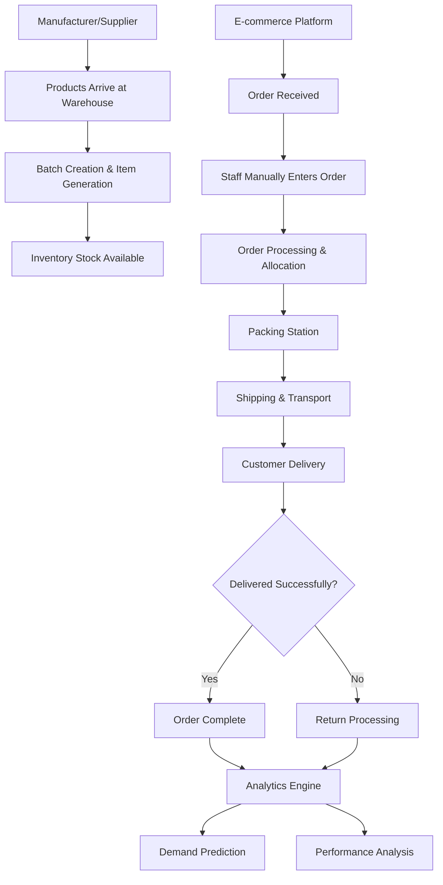
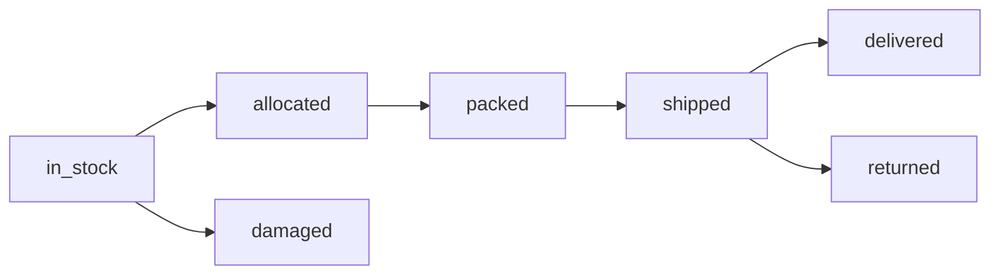

# SmartStock Fulfillment Center System

## Overview

This is a streamlined **fulfillment center/warehouse management system** designed to receive orders from e-commerce platforms and process them for delivery. The system focuses on efficient order fulfillment without complex customer management.

---

## 🏭 System Architecture



---

## 📋 Fulfillment Order Lifecycle

### **Status Flow**
```
received → processing → packed → shipped → delivered
               ↓
          cancelled/returned
```

### **Stage 1: Order Reception**
- **Source**: E-commerce platform (Shopify, Amazon, Website, etc.)
- **Entry**: Manual entry by staff (future: automated API integration)
- **Data**: Customer info, shipping address, items, pricing

### **Stage 2: Order Processing**
- **Inventory Allocation**: FIFO-based allocation
- **Item Status**: `in_stock` → `allocated`
- **Staff Assignment**: Processing staff assigned

### **Stage 3: Packing**
- **Package Generation**: Unique package ID created
- **Item Status**: `allocated` → `packed`
- **Packing Notes**: Special instructions recorded

### **Stage 4: Shipping**
- **Transport Creation**: Carrier assignment and tracking
- **Item Status**: `packed` → `shipped`
- **Tracking**: Customer tracking number generated

### **Stage 5: Delivery**
- **Status Update**: Final delivery confirmation
- **Item Status**: `shipped` → `delivered`
- **Analytics**: Performance metrics recorded

---

## 🔗 API Endpoints

### **Order Management**
```
POST   /api/v1/fulfillment/receive           - Receive order from e-commerce platform
POST   /api/v1/fulfillment/process/:orderNumber - Process order (allocate inventory)
POST   /api/v1/fulfillment/pack/:orderNumber    - Pack order
POST   /api/v1/fulfillment/ship/:orderNumber    - Ship order
POST   /api/v1/fulfillment/delivered/:orderNumber - Mark as delivered
GET    /api/v1/fulfillment/track/:identifier    - Track order (public)
GET    /api/v1/fulfillment/                     - Get all orders with filtering
POST   /api/v1/fulfillment/return/:orderNumber  - Process return
```

### **Inventory Management** (Existing)
```
POST   /api/v1/inventory/add-supply      - Add new inventory from supplier
GET    /api/v1/inventory/all             - View all inventory
POST   /api/v1/inventory/mark-damaged    - Mark inventory as damaged
```

---

## 📊 Sample API Usage

### **1. Receive Order from E-commerce Platform**
```bash
POST /api/v1/fulfillment/receive
```

```json
{
  "platformOrderId": "SHOP_12345",
  "platform": "shopify",
  "customerInfo": {
    "name": "John Doe",
    "email": "john@example.com",
    "phone": "+1234567890"
  },
  "shippingAddress": {
    "street": "123 Main St",
    "city": "New York",
    "state": "NY",
    "zipcode": "10001",
    "country": "USA"
  },
  "items": [
    {
      "productId": "product_id_here",
      "quantity": 2,
      "unitPrice": 29.99
    }
  ],
  "subtotal": 59.98,
  "tax": 6.00,
  "shipping": 9.99,
  "total": 75.97,
  "priority": "normal",
  "specialInstructions": "Handle with care"
}
```

### **2. Process Order (Allocate Inventory)**
```bash
POST /api/v1/fulfillment/process/ORD-1720094875123-ABC123
```

```json
{
  "packingNotes": "Use bubble wrap for fragile items"
}
```

### **3. Pack Order**
```bash
POST /api/v1/fulfillment/pack/ORD-1720094875123-ABC123
```

```json
{
  "packingNotes": "Packed with extra protection",
  "specialPackaging": true
}
```

### **4. Ship Order**
```bash
POST /api/v1/fulfillment/ship/ORD-1720094875123-ABC123
```

```json
{
  "transporterId": "transporter_id",
  "shippingMethod": "standard",
  "shippingNotes": "Standard ground shipping"
}
```

### **5. Track Order (Public Endpoint)**
```bash
GET /api/v1/fulfillment/track/ORD-1720094875123-ABC123
# OR
GET /api/v1/fulfillment/track/SHOP_12345
# OR  
GET /api/v1/fulfillment/track/TRK-ABC12345
```

---

## 📈 Analytics & Performance Tracking

### **Processing Time Metrics**
- **Order to Processing**: Time from receipt to allocation
- **Processing to Packed**: Time from allocation to packing
- **Packed to Shipped**: Time from packing to shipping
- **Shipped to Delivered**: Time from shipping to delivery

### **Performance KPIs**
- Order fulfillment rate
- Average processing time
- Shipping accuracy
- Customer satisfaction (via returns rate)

### **Demand Analytics**
- Product velocity analysis
- Seasonal demand patterns
- Inventory optimization recommendations
- Reorder point calculations

---

## 🔄 Item Status Tracking

### **Item Lifecycle**


### **Status Definitions**
- **in_stock**: Available in inventory
- **allocated**: Reserved for specific order
- **packed**: Packaged and ready to ship
- **shipped**: In transit to customer
- **delivered**: Successfully delivered
- **returned**: Returned by customer
- **damaged**: Marked as damaged/unusable

---

## 🎯 Key Features

### **✅ No Customer Entity Needed**
- Customer info stored within each order
- No complex customer relationship management
- Focus on order fulfillment efficiency

### **✅ E-commerce Platform Integration Ready**
- Support for multiple platforms (Shopify, Amazon, etc.)
- Platform-specific order IDs tracked
- Future API automation ready

### **✅ FIFO Inventory Allocation**
- Oldest inventory used first
- Automatic expiry date management
- Batch-level traceability

### **✅ Staff Performance Tracking**
- Individual staff assignment for each stage
- Processing time analysis per staff member
- Performance optimization insights

### **✅ Complete Audit Trail**
- Every item status change recorded
- Full order lifecycle tracking
- Analytics for process improvement

### **✅ Return Processing**
- Automatic inventory restoration for good returns
- Damage tracking for defective items
- Return reason analysis

---

## 🚀 Future Automation (Phase 2)

### **API Integration with E-commerce Platforms**
```javascript
// Future webhook endpoint for automated order receipt
POST /api/v1/fulfillment/webhook/shopify
POST /api/v1/fulfillment/webhook/amazon
POST /api/v1/fulfillment/webhook/website
```

### **Automated Features**
- Real-time order sync from e-commerce platforms
- Automatic inventory allocation
- Smart packing optimization
- Predictive demand forecasting
- Automated reorder point management

---

## 📊 Database Schema

### **FulfillmentOrder Model**
```javascript
{
  orderNumber: "ORD-{timestamp}-{random}",
  platformOrderId: "SHOP_12345", // E-commerce platform order ID
  platform: "shopify|amazon|website|manual",
  
  customerInfo: {
    name: String,
    email: String, 
    phone: String
  },
  
  shippingAddress: {...},
  
  items: [{
    productId: ObjectId,
    sku: String,
    quantity: Number,
    unitPrice: Number,
    batchId: ObjectId, // Allocated batch
    allocatedItemIds: [ObjectId] // Specific items allocated
  }],
  
  orderStatus: "received|processing|packed|shipped|delivered|cancelled|returned",
  
  // Staff assignments
  receivedBy: ObjectId,
  processedBy: ObjectId,
  packedBy: ObjectId,
  
  // Timestamps
  receivedAt: Date,
  processedAt: Date,
  packedAt: Date,
  shippedAt: Date,
  deliveredAt: Date,
  
  // Performance metrics
  processingTimes: {
    orderToProcessing: Number, // minutes
    processingToPacked: Number, // minutes
    packedToShipped: Number,   // minutes
    shippedToDelivered: Number // hours
  },
  
  packageId: String,
  trackingNumber: String,
  priority: "low|normal|high|urgent"
}
```

---

## 🎯 Benefits of This Approach

### **✅ Simplified Management**
- No complex customer relationships
- Focus on operational efficiency
- Streamlined order processing

### **✅ Scalable Architecture**
- Easy integration with multiple e-commerce platforms
- Automated processing ready
- Performance optimization built-in

### **✅ Analytics-Driven**
- Complete data collection for demand forecasting
- Performance metrics for continuous improvement
- Inventory optimization insights

### **✅ Staff Productivity**
- Clear role assignments
- Performance tracking
- Process optimization

This system provides exactly what you need: a focused fulfillment center that efficiently processes orders from e-commerce platforms while collecting comprehensive data for analytics and future demand prediction.
